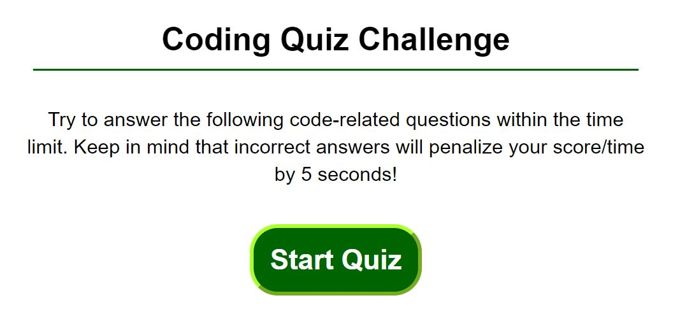

# Quiz_06272020

This is an interactive, multiple choice question quiz. It is based on a countdown time, which can be changed from the script.js file. 
When user selects an answer, quiz will validate with a dynamic alert to let user if answer is correct/wrong. If answer is wrong, time is decremented from the countdown timer. When the quiz is complete, user receives an alert to indicate the same. The last page of this quiz display user score, once user puts their initials, it is stored in local storage and will continue to display, until deleted by user.

Link to the quiz:
https://purilisa.github.io/Quiz_06272020/

Link to the Repository:
https://github.com/purilisa/Quiz_06272020

Images:

